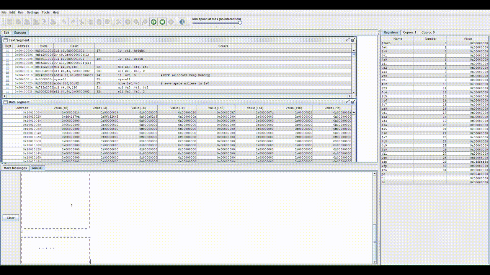

# Snake Game in MIPS Assembly 🐍

## Overview

This project is a **text-based implementation of the classic Snake game** written entirely in **MIPS assembly language**. It was developed as part of a Computer Architecture course to demonstrate low-level programming concepts, including dynamic memory allocation, data structures, keyboard input handling, and game logic implementation without the use of high-level programming constructs.

## Features

- Terminal-based gameplay
- Real-time keyboard controls (`W`, `A`, `S`, `D`)
- Random fruit generation
- Snake growth after eating fruit
- Collision detection with walls and the snake's own body
- Automatic game over detection
- Dynamic game board allocation in memory

## Game Logic

The game is played on a **20 × 20** board surrounded by walls.

The snake starts with a predefined length and moves according to the player's input:

- **W** – move up
- **A** – move left
- **S** – move down
- **D** – move right
- **E** – exit the game

Whenever the snake eats a fruit:

- its length increases,
- a new fruit is generated at a random empty position on the board.

The game ends when the snake:

- collides with a wall,
- collides with its own body,
- or the player exits the game.

## Implementation Details

The project is implemented entirely in **MIPS assembly** and uses dynamically allocated memory for storing the game board, snake body positions, game state variables (head position, tail position, fruit position, snake length).

The implementation is divided into several procedures responsible for different aspects of the game:
- board initialization,
- board rendering,
- snake movement,
- collision detection,
- fruit generation,
- queue-based snake body management.

The snake body is maintained using head and tail pointers together with an auxiliary array that stores the order of body segments, allowing efficient movement without shifting the entire snake.

